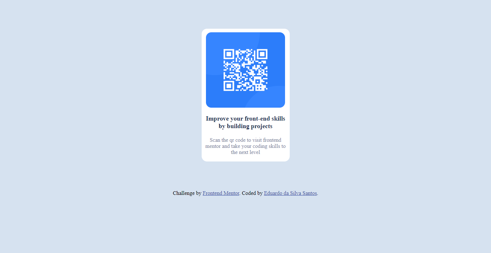

# Frontend Mentor - QR code component solution

## Table of contents

- [Overview](#overview)
  - [Screenshot](#screenshot)
  - [Links](#links)
- [My process](#my-process)
  - [Built with](#built-with)
  - [What I learned](#what-i-learned)
  - [Continued development](#continued-development)
  - [Useful resources](#useful-resources)
- [Author](#author)
- [Acknowledgments](#acknowledgments)

## Overview

Achei bem pratico e divertido, porém acho que tive uma dificuldade em deixar os texto igual foi proposto.

### Screenshot



### Links

- Live Site URL: (https://your-live-site-url.com)

## My process

### Built with

- Semantic HTML5 markup
- CSS custom properties
- Flexbox
- CSS Grid
- Mobile-first workflow
- For styles

### What I learned

```html
<section class="container">
  <div class="main-container">
    <div class="card-container">
      
      <div class="title">
        <h3>Improve your front-end skills by building projects</h3>
        <p>
          Scan the qr code to visit frontend mentor and take your coding skills
          to the next level
        </p>
      </div>
    </div>
  </div>
</section>
```

```css
:root {
  --white: hsl(0, 0%, 100%);
  --light-gray: hsl(212, 45%, 89%);
  --grayish-blue: hsl(220, 15%, 55%);
  --dark-blue: hsl(218, 44%, 22%);
}

* {
  margin: 0;
  padding: 0;
  box-sizing: border-box;
}
.attribution {
  font-size: 15px;
  text-align: center;
}
.attribution a {
  color: hsl(228, 45%, 44%);
}
body {
  background: var(--light-gray);
}
.container {
  display: flex;
  justify-content: space-around;
  align-items: center;
  margin: 80px;
}

.main-container {
  background-color: var(--white);
  width: 245px;
  height: 370px;
  border-radius: 15px;
}
.card-container {
  display: grid;
  justify-items: center;
}
.card-container img {
  width: 220px;
  height: 210px;
  border-radius: 15px;
  margin: 10px;
}
.title {
  text-align: center;
  font-size: 15px;
}
.title h3 {
  padding: 10px;
  font-weight: 700;
  color: var(--dark-blue);
}
.title p {
  padding: 10px;
  color: var(--grayish-blue);
}
```

### Continued development

### Useful resources

## Author

## Acknowledgments

Eu quero agradecer ao pessoal do discord que por acaso eu vi alguém publicando link desse site [https://www.frontendmentor.io/home] e pessoal explicou que era onde você pegava projetos prontos e colocaria em pratica. Fiquei curioso e fui da uma olhada e sinceramente amei.
